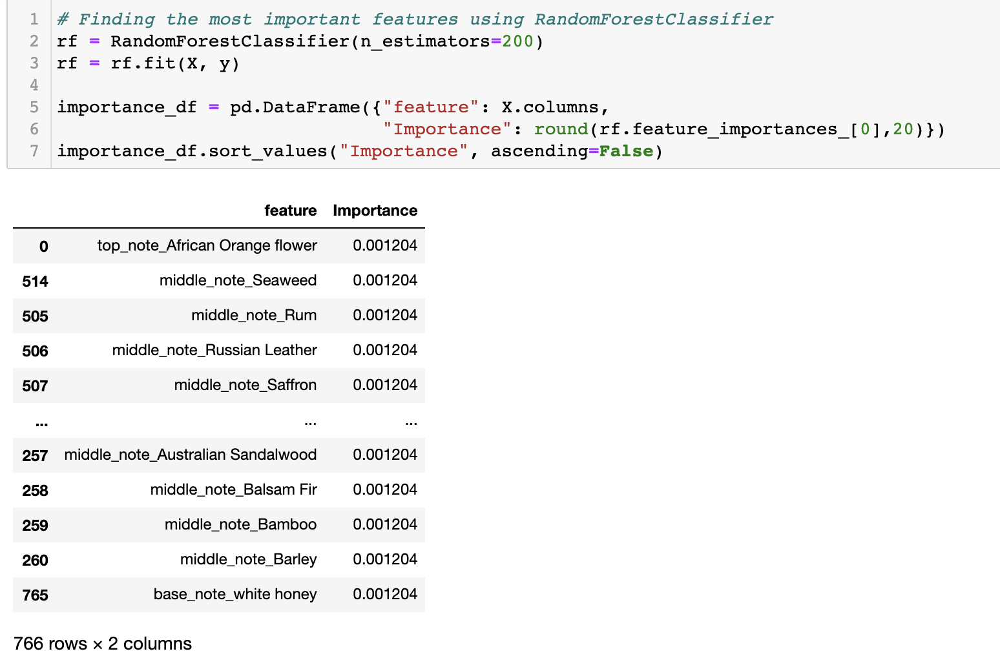
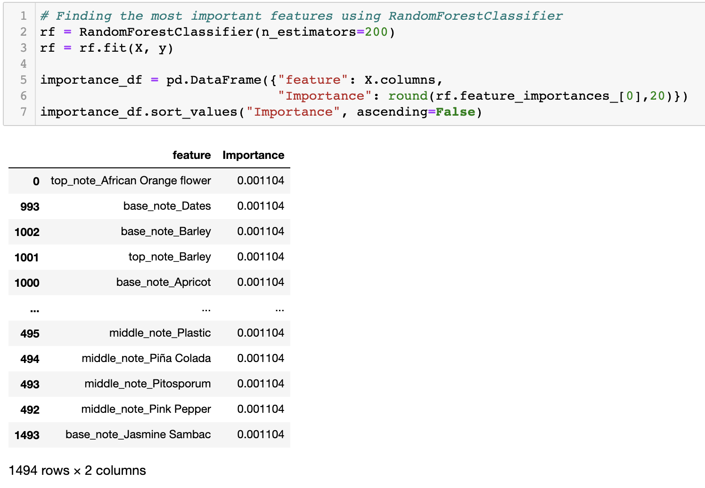
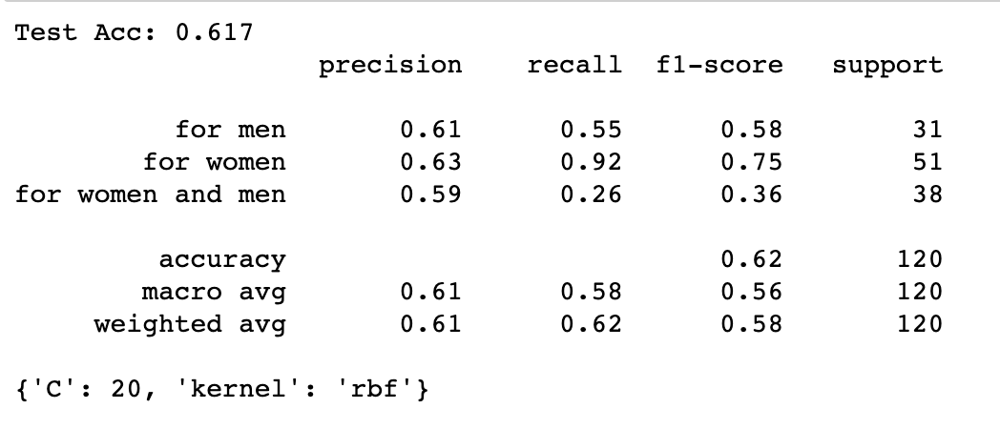
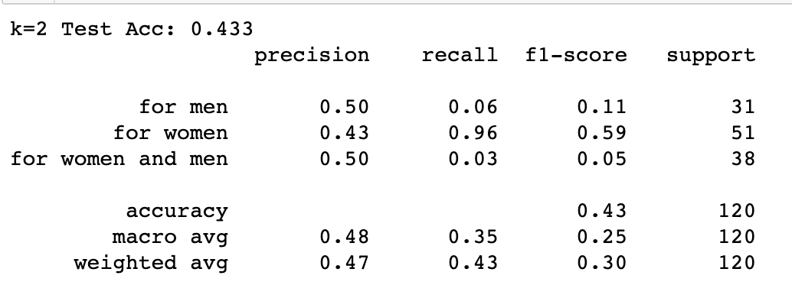
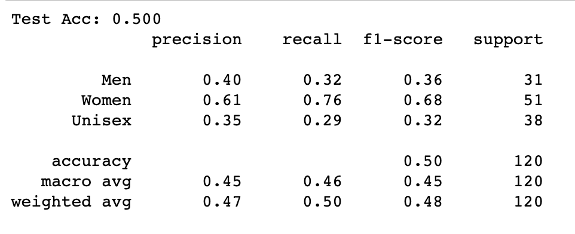

# Scent Angels
We have created a website that uses machine learning to predict a perfume’s popularity based on certain perfume features: accord, notes, sillage etc. and have built a “Perfume Designer” App where you can create your perfume and see if it would be popular or not.
Check out a brief introduction to our website development, here: https://docs.google.com/presentation/d/1kLpmB_BrK-Ui5TlWWvtS06L78TBK4_cAGl9DQRv548c/edit#slide=id.gbf44f01a53_0_25  
Check out our LIVE Heroku Webpage here: Heroku link goes here


## Find Your Favorite Scent! 


## Table of contents
* [General Info](#general-info)
* [Data Sources](#data)
* [Technologies](#technologies)
* [Libraries & Dependencies](#libraries)
* [Data Processing and Cleanup](#data-processing)
* [Machine Learning Development](#machine-learning)
* [Tableau Development](#tableau)
* [Setup](#setup)
* [Lessons Learned](#status)
* [Inspiration](#inspiration)
* [Contact](#contact)

## General info
### Team Members:
- [Chloe Veras](https://github.com/cveras33)
- [Deepa Vadakan](https://github.com/deepavadakan)
- [Jennifer Dean](https://github.com/Jen-Dean)
- [Jessi Volosin](https://github.com/jvolosin)
- [Kasey Lacerda](https://github.com/KLacerda08)
- [Osvaldo (Ozzie) Mauricio Moreno](https://github.com/sir-omoreno)

## Data Sources

### Web Scraping Data
- [Fragrantica](https://www.fragrantica.com/)

## Technologies
* Python
* Flask
* Javascript
* HTML/ CSS
* Bootstrap
* JSON
* MongoDB
* Heroku

## Libraries 
**Libraries**
* [Bootstrap](https://getbootstrap.com/docs/4.0/getting-started/introduction/)

**Python Dependencies**
* Pandas
* Numpy
* Flask
* Flask_pymongo
* Splinter
* Selenium
* BeautifulSoup
* Webdriver_manager.chrome
* Pymongo
* Pprint 

**HTML CSS Dependencies**
* [Bootstrap Stylesheet](https://maxcdn.bootstrapcdn.com/bootstrap/3.3.7/css/bootstrap.min.css)

## Data Processing and Cleanup
### Selecting Data Source 
Our process for finding data sources was... 
**Note**: We had to scrape the data by year because we could only pull 1,000 records at a time. On the main search page when you click "see more results" the page maxed out at 1,000 perfumes. So, by filtering by year we were able to collect 1,000 records for each year. If a year had more than 1,000 perfumes produced that year then those extra perfumes are not reflected in our database. 

The Fragrantica website gave information on perfumes/cologne available for sale, including the following information:  
- Fragrance name and designer 
- Main accords
- Top notes, middle notes, and base notes 
- Perfume rating out of 5
- Sillage and Longevity
- Price Value
- Gender

### Data Cleanup 
**Web Scraping Data**:
- Web scrape in jupyter notebook 
- Converted data to a dictionary or list of dictionaries 
- Exported to MongoDB 

## Machine Learning Development

Based on the perfume notes, we wanted to check if we could predict if the perfume is for men, women or unisex.

We loaded the perfume data from MongoDB. The perfume notes are divided as top, middle and base notes. Each of these fields is a list. So we had to use MultiLabelBinarizer to create a feature column for each note based on if it is a top, middle or base note.



If a note was not an ingredient in the perfume, it was marked as 0, otherwise it was marked as 1. We decided to use only notes as features. Accords are a combination of notes, so we dropped that as a feature. Longevity, Sillage, gender vote and price value does not affect the outcome of if the perfume is for a particular gender, so we skipped those as features as well. After dropping unnecessary columns from the perfume dataframe, the resulting was X(data) which are all the features and y(target) was if the perfume was for men, women or unisex. 

A dataframe was created listing all the features and uploaded to MongoDB. We will use this later in app.py. Another dataframe with all the notes from the perfumes in the perfume_data collection was created and added to MongoDB as notes_features. This is used for the list of notes on the "Create A Frangrance" page.

We also looked at the feature importance, but did not remove any since they had almost the same importance.



After splitting the data into train and test we tried the following Models and checked their classification reports to find out which was the best model:

#### SVC



We used GridSearch with the following parameters:   
```param_grid = {'C': [5, 20, 50],
              'kernel': ('linear', 'rbf')}
```

#### KNearestNeighbors



#### DecisionTree



#### RandomForest


#### Deep Learning Neural Network


From the classification reports, we decided that SVC with kernel:rbf and C=20 was the best model with an accuracy of 0.62.

We saved this model using joblib.   
```import joblib
final_model = grid.best_estimator_
filename = '../webapp/static/Resources/gender_perfume_model.sav'
joblib.dump(final_model, filename)
```


## Tableau Development

## Setup

**NOTE**: The following files were involved in web-scraping or used to export data to the Mongo DB: 
- Notes_Scrape.ipynb 
- Perfume_Scrape.ipynb

**MongoDB creation:**
- mongo_db/mongo_db_creation.ipynb

**Machine Learning Model**
- ML/Perfume_ML_Gender.ipynb

#### Setup Instructions

Create a new conda environment with python version 3.7
Use pip install -r requirements.txt

## Lessons Learned

We had initially planned to create a machine learning model that would predict the popularity of the perfume based on the perfume features. However, this model returns negative R2 scores indicating that the model was just not a bad but extremely terrible fit for the data.

## Inspiration
Inspired by Rutgers Data Visulization Bootcamp & smelly people everywhere!

## Contact
Created by:
- [Chloe Veras](https://github.com/cveras33)
- [Deepa Vadakan](https://github.com/deepavadakan)
- [Jennifer Dean](https://github.com/Jen-Dean)
- [Jessi Volosin](https://github.com/jvolosin)
- [Kasey Lacerda](https://github.com/KLacerda08)
- [Osvaldo (Ozzie) Mauricio Moreno](https://github.com/sir-omoreno)